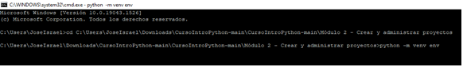
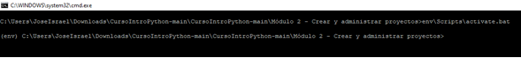
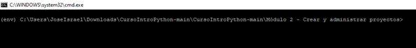
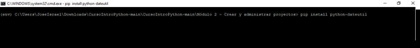
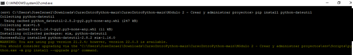
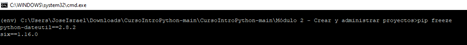
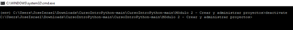

# Ejercicio - Crear un paquete

En este ejercicio, aprenderás a utilizar entornos virtuales como una forma para no afectar a los paquetes instalados globalmente u otros programas que se ejecutan en tu máquina.

*Para este ejercicio es necesario que lo ejecutes desde la terminal, línea de comandos, cmd, consola, cli, etc. de tu computadora, sé que es desafíante, pero no te preocupes ¡¡Sé que puedes lograrlo!!*

## Crear un entorno virtual

Para crear el entorno virtual, accedemos a la carpeta donde se almacenará y ejecutamos el módulo `env`.

Esto creará el directorio `env` si no existe.

Ahora bien, para comenzar a utilizar el entorno virtual es necesario activarlo mediante el script `env\Scripts\activate.bat`.

Cuando activamos el entorno virtual cambiará el prompt de la consola y mostrará el entorno virtual que estamos utilizando.

## Instalar una biblioteca

Por consiguiente, para instalar paquetes en nuestro entorno virtual, tendremos que ejecutar el comando `pip`. En este ejemplo, instalaremos el módulo `dateutil`.

Una vez finalizada la instalación nos aparecerá la información referente al módulo instalado.

Para comprobar todos los paquetes que tenemos instalados en el entorno virtual, será necesario ejecutar el siguiente comando `pip freeze`.

### Desactivar un entorno virtual

Por último, para salir del entorno virtual ingresaremos el comando `deactivate`.

